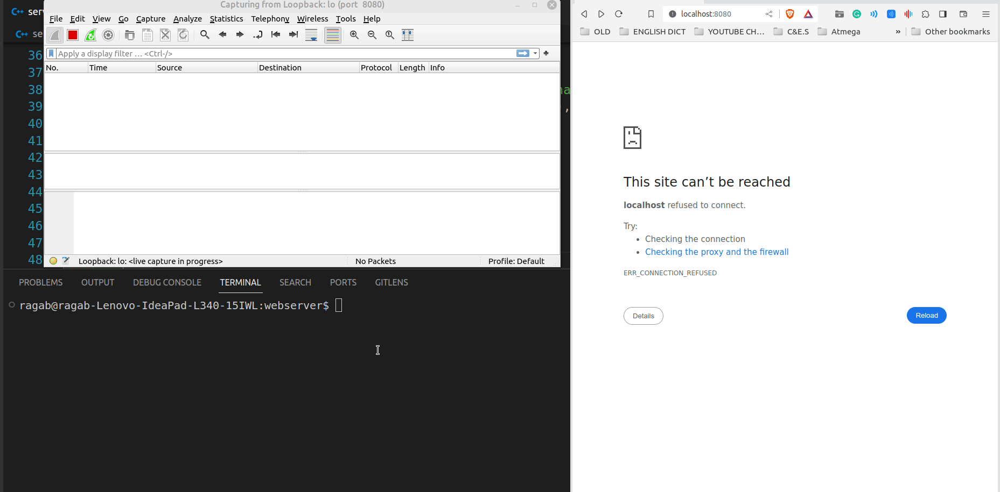

# C++ Web Server - Integer Sum Calculator
<!--
-->
<kbd></kbd>
## Description
This is a simple C++ web server application that serves an HTML form allowing users to input two integers and calculate their sum. The server handles the calculation and sends the result back to the client.

## Technologies
- C++ for the server application.
- HTML and JavaScript for the client-side user interface.

## Features
- User-friendly HTML form for entering two integers.
- Real-time calculation of the sum on the server.
- Error handling for invalid input values.
- Simple C++ server that listens on a specified port.
- Handling of HTTP requests and responses.
- Multithreaded server to handle multiple client connections.

## Setup
1. Clone this repository to your local machine.
2. Ensure you have a C++ compiler (e.g., g++) installed.
3. Make sure the `index.html` file is in the same directory as the server executable.
4. Compile the C++ code using the command:
   ```shell
   g++ server.cpp -o server
5. Run the server:

    ```
    ./server
    ```
Open a web browser and navigate to http://localhost:8080 to access the Integer Sum Calculator.
